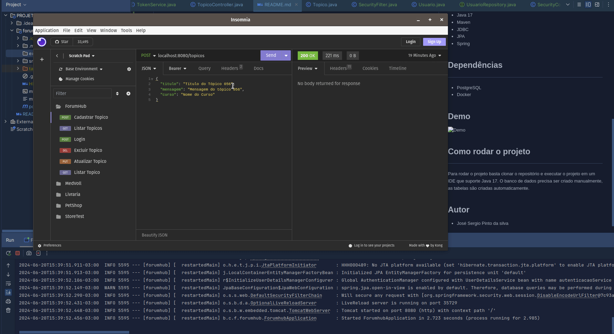

# PROJETO-ForumHub

## Descrição

---

Esse projeto faz parte da trilha de aprendizado proposta pela Alura em parceria com a Oracle. O Objetivo é criar um
backend para um fórum de discussão. 
O projeto foi desenvolvido Lombok
Spring Web
Spring Boot DevTools
Spring Data JPA
Flyway Migration
MySQL Driver
Validation
Spring Security

## Objetivos de aprendizado

---

- Aprender a utilizar o Spring Boot
- Aprender a utilizar o Spring Data JPA
- Aprender a utilizar o Spring Security
- Aprender a utilizar o Flyway Migration
- Aprender a utilizar o Lombok
- E dentre outras tecnologias

## Tecnologias utilizadas

---

- Java 17
- Maven
- JDBC
- JPA
- Spring

## Dependências

---

- MySQL
- Docker para rodar o banco de dados

## Demo

## Como rodar o projeto

---

Para rodar o projeto basta
clonar o repositório e executar o projeto em um IDE
que suporte Java 17.
O banco de dados precisa ser criado manualmente, as
tabelas são criadas automaticamente.

## Autor
- José Sergio Pinto da silva

Linkedin: [José Sergio Pinto da Silva](www.linkedin.com/in/josésérgiopsilva)

